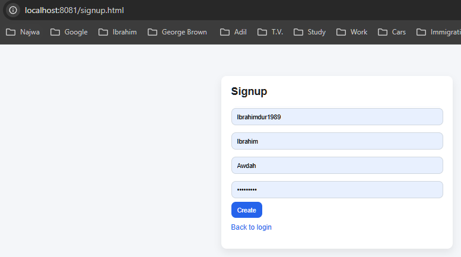
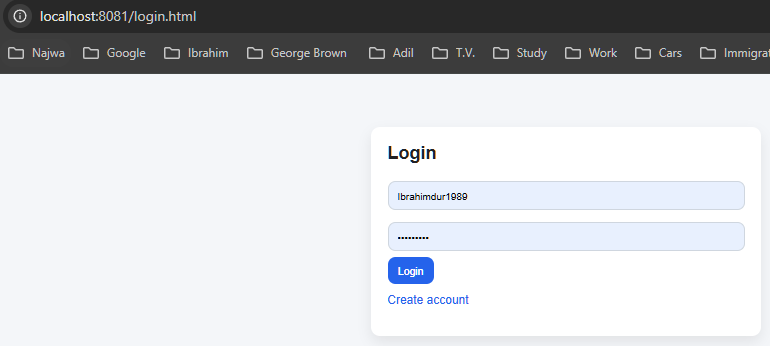
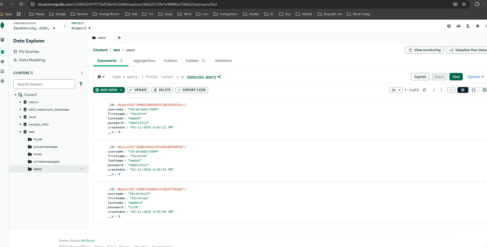
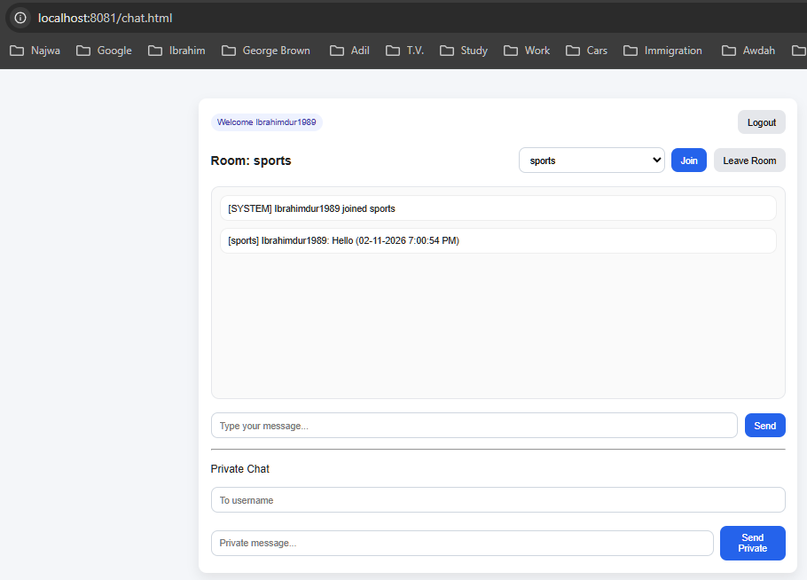
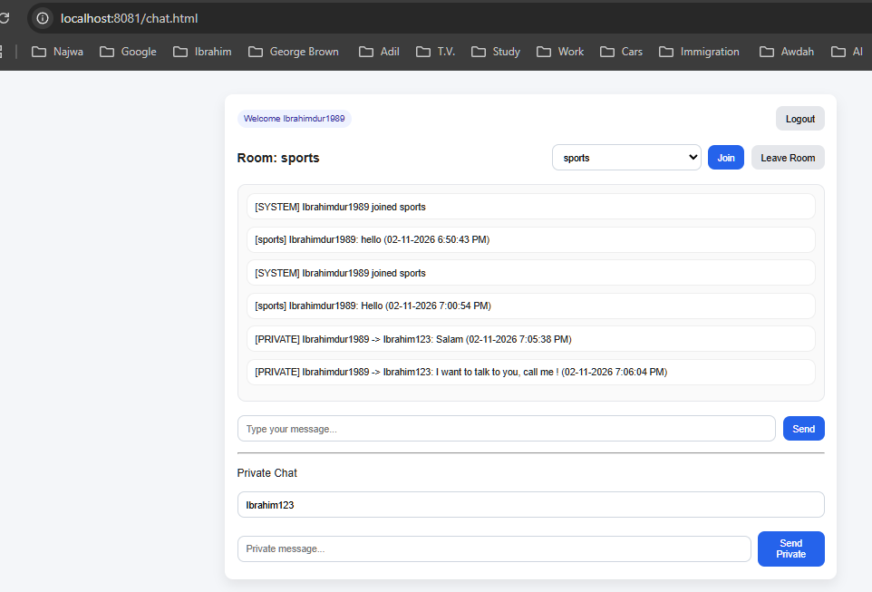
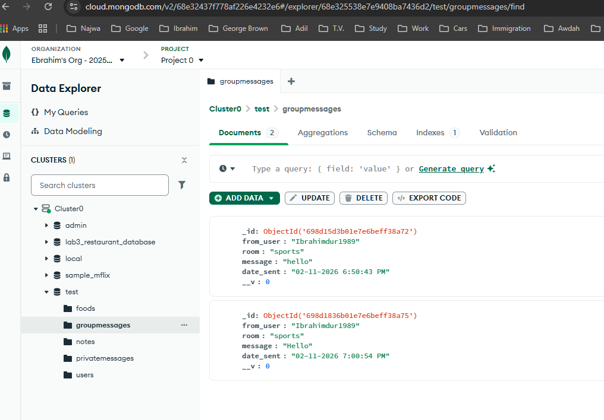
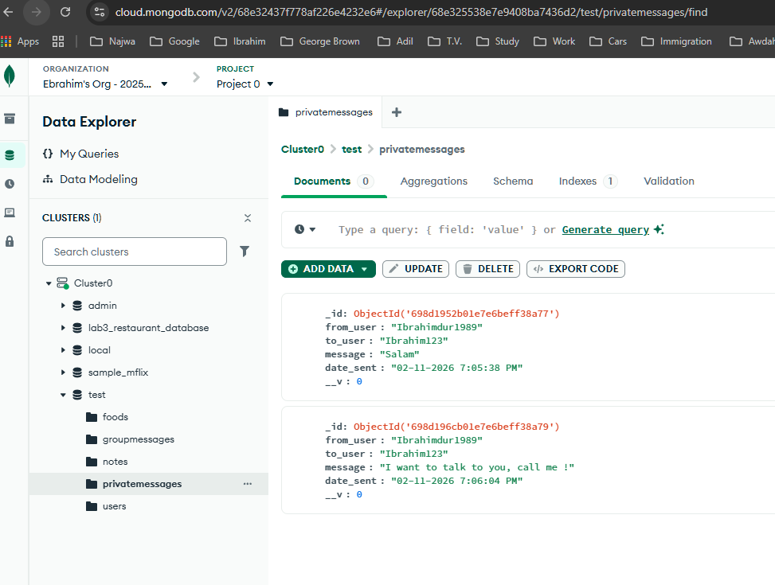

# 101085527_lab_test1_chat_app

Student ID: 101085527  
Course: COMP 3133 – Full Stack Development II  
Lab Test 1 – Chat Application  

---

## Description

This is a real-time chat application built using:

- Node.js
- Express
- MongoDB Atlas
- Mongoose
- Socket.io
- HTML, CSS, JavaScript

The application supports authentication, room-based chat, private chat, typing indicator, and message storage in MongoDB.

---

## Features

- User Signup (unique username)
- User Login (session stored in localStorage)
- Join / Leave predefined rooms
- Real-time group chat
- Private messaging
- Typing indicator (1-to-1)
- Messages saved in MongoDB
- Logout

---

## How to Run

1. Go to server folder:
   cd server

2. Install dependencies:
   npm install

3. Add your MongoDB connection string inside `.env`

4. Start server:
   node server.js

5. Open in browser:
   http://localhost:8081/signup.html

---
### GitHub Repository link: 
- https://github.com/Ibrahimdur1989/101085527_lab_test1_chat_app

## Screenshots

### Signup Page

### Login Page

### MongoDB Users Collection

### Chat Room

### Private Message

### Group Messages Stored in MongoDB

### Private Messages Stored in MongoDB
